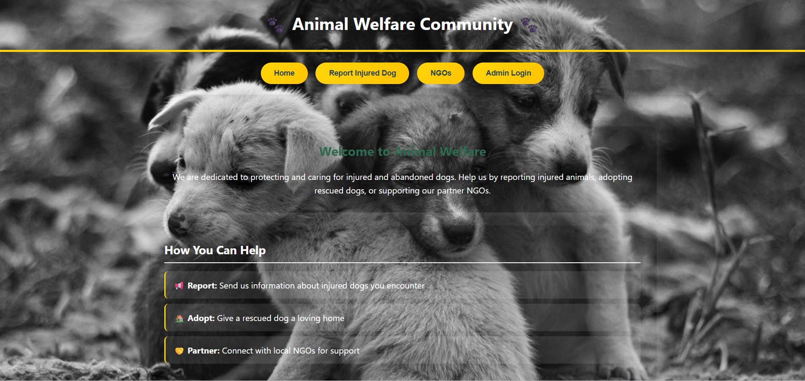
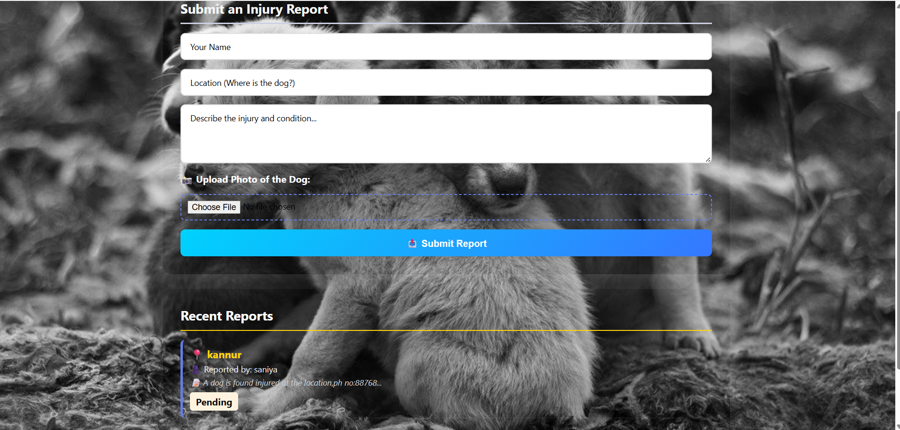

# 🐾 AnimalWelfare 🎯  

## 📌 Basic Details  

**Team Name:** codeX  

### 👥 Team Members  
- **Ritharaj P** – College of Engineering Munnar  
- **Saniya Ajith** – College of Engineering Munnar  

### 🔗 Hosted Project Link  
https://drive.google.com/file/d/1nu85w4cKgNwXR4P6L3iq0B2dwx9zqZRI/view?usp=sharing 

---

## 📖 Project Description  

AnimalWelfare is a community-driven web platform that enables citizens to report injured or abused stray dogs and connect them with rescuers. Administrators manage rescue cases, and once animals are rehabilitated, they become available for adoption through the platform.  

The system improves rescue response time and promotes responsible pet adoption.

---

## ❗ Problem Statement  

Stray dogs that are injured, abandoned, or abused often do not receive timely help because citizens do not know whom to contact, and rescue efforts are fragmented across informal networks.  

Additionally, rescued animals struggle to find adopters due to lack of visibility and coordination.

---

## 💡 The Solution  

The platform bridges this gap by:

- Allowing citizens to report injured or abused stray dogs with location details  
- Enabling administrators to verify and manage rescue cases  
- Making rescued animals available for adoption  
- Providing a centralized system connecting citizens, rescuers, and adopters  

---

## ⚙️ Technical Details  

### 🖥️ Technologies Used  

#### 🔹 For Software  

- **Languages:** JavaScript, HTML, CSS  
- **Frameworks:** Node.js, Express.js  
- **Libraries:**  
  - Mongoose (Database interaction)  
  - Multer (Image upload handling)  
  - CORS (Cross-origin requests)  
- **Tools:**  
  - VS Code  
  - Git & GitHub  
  - MongoDB  
  - MongoDB Compass  
  - Chrome DevTools  

#### 🔹 For Hardware  
_Not Applicable (Web-based Project)_  

---

## ✨ Features  

- 🐶 Report injured or abused stray dogs with location details  
- 🛠️ Admin-managed tracking and resolution of rescue cases  
- 🏠 Adoption system for rescued and rehabilitated animals  
- 🌐 Centralized platform connecting citizens, rescuers, and adopters  

---

## 🚀 Implementation  

### 🔧 Installation  

```bash
npm install
```

### ▶️ Run the Project  

```bash
node server.js
```

---

## 📂 Project Documentation  

### 📸 Screenshots  

> Make sure these images are inside your project folder.

#### 🏠 Home Page  

Displays the main landing page where users can navigate to report or adoption sections.

#### 📝 Rescue Report Page  
  
Allows users to submit details about injured or abused stray dogs with location and image upload.

#### 🔐 Admin Page  
  
Admin dashboard for managing rescue reports and updating case status.

---

## 🏗️ System Architecture  

The system begins when a user accesses the website and chooses an action such as reporting an injured dog or submitting an adoption request.  

The frontend collects user data and sends it to the backend server through API requests. The backend processes the request using Express.js and stores the data in MongoDB.  

An admin logs into the admin panel to review rescue reports and adoption requests. Once a rescue is completed, the animal becomes available for adoption. Updated data is sent back to the frontend so users can see real-time status changes.

---

## 🔄 Application Workflow  

1. A user opens the website and submits a rescue report with location and details.  
2. The backend stores the report in MongoDB.  
3. The admin reviews and verifies the case.  
4. After rescue completion, the admin marks the case as resolved.  
5. The rescued animal becomes available on the adoption page.  
6. Interested users submit adoption requests for admin review.

---

## 📡 API Documentation  

**Base URL:** `http://localhost:3000`

### 📥 GET Endpoints  

#### `GET /reports`
Fetch all rescue reports.

#### `GET /adoptions`
Fetch all animals available for adoption.

---

### 📤 POST Endpoints  

#### `POST /report`
Submit a new rescue report.

**Request Body Example:**
```json
{
  "name": "John",
  "location": "Munnar",
  "description": "Injured stray dog near bus stand"
}
```

---

#### `POST /adoption`
Submit an adoption request.

**Request Body Example:**
```json
{
  "name": "Anita",
  "contact": "9876543210",
  "animalId": "12345"
}
```

---

## 🤖 AI Tools Used (For Transparency Bonus)  

**Tool Used:** ChatGPT  

**Purpose:**  
- Debugging backend errors  
- Structuring REST API endpoints  
- Improving documentation  

**Approximate AI-generated Code:** 20–30%  

**Human Contributions:**  
- Architecture design  
- Frontend and backend development  
- Database integration  
- Testing and debugging  
- UI/UX decisions  

---

## 👩‍💻 Team Contributions  

**Ritharaj P:**  
- Frontend development  
- Backend development  
- Database integration  

**Saniya Ajith:**  
- Backend development  
- Frontend integration  
- Testing and debugging  

---

## 📜 License  

This project is licensed under the **MIT License**.

---

Made with ❤️ at TinkerHub